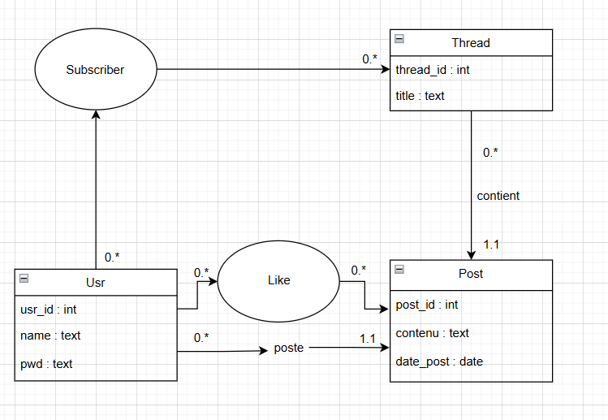

# Documentation de l'application **LilleConnect**

## 1. Description générale de l’application
LilleConnect est une application web de réseau social dédiée aux étudiants. Elle permet la création de fils de discussion, la gestion des utilisateurs, et l'interaction via des messages et des likes.

### Fonctionnalités principales :
- Création et gestion de threads (fils de discussion)
- Publication de messages
- Système de likes sur les messages
- Gestion des abonnements aux threads
- Authentification et sécurisation des données

Vous pouvez avoir accès aux posts d'un utilisateur au format JSON avec la commande suivant :
```
curl -i -X GET http://localhost:8080/LilleConnect/posts/<id>
```

---

##  2. Conception
### 2.1 Modèle Conceptuel des Données (MCD)



### 2.2 Modèle Logique des Données (MLD)

- **usr** (<u>id</u>, name, pwd)
- **thread** (<u>id</u>, titre, _#admin_id_)
- **post** (<u>id</u>, contenu, date, _#thread_id, #usr_id_)
- **like** (<u>_#post_id, #usr_id_</u>)
- **subscriber** (<u>_#thread_id, #usr_id_</u>)

## 3. Requêtes SQL pertinentes (Partie 1)

### Récupération des données d'un utilisateur suivant son nom et mot de passe
```sql
SELECT * FROM usr WHERE name = ? AND pwd = ?
```

### Récupération des utilisateurs abonnés à un thread
```sql
SELECT u.id, u.name 
FROM usr u JOIN subscriber s ON u.id = s.usr_id AND s.thread_id = ?
```

### Récupération des utilisateurs non-abonnés à un thread
```sql
SELECT u.id, u.name 
FROM usr u LEFT JOIN subscriber s ON u.id = s.usr_id AND s.thread_id = ? 
WHERE s.usr_id IS NULL
```

### Récupération du nombre de likes par post
```sql
SELECT COUNT(*)
FROM likes WHERE post_id = ?
```

### Récupération des posts d'un thread
```sql
SELECT post.id, post.contenu, usr.name, post.usr_id 
FROM post JOIN usr ON post.usr_id = usr.id 
WHERE thread_id = ? 
ORDER BY post.id ASC
```

### Récupération des threads auxquels un utilisateur est abonné
```sql
SELECT t.id, t.title 
FROM thread t JOIN subscriber s ON t.id = s.thread_id
WHERE s.usr_id = ?
```

### Vérification si un utilisateur est bien abonné à un thread
```sql
SELECT 1 
FROM subscriber 
WHERE usr_id = ? AND thread_id = ?
```

### Vérification si un utilisateur a déjà liké un post
```sql
SELECT 1 
FROM likes 
WHERE usr_id = ? AND post_id = ?
```

### Vérification si un utilisateur est bien l'admin d'un thread
```sql
SELECT admin_id FROM thread WHERE id = ? AND admin_id = ?
```

## 4. Arborescence du projet
```
├───res # Ressources images
├───sql # Fichiers SQL
├───WEB-INF
│   ├───classes
│   │   ├───controller
│   │   ├───dao
│   │   └───dto
│   └───java
│       └───src
│           ├───controller
│           ├───dao
│           └───dto
├───creation.html
├───index.html
├───dashboard.jsp
├───thread.jsp
└───README.md
```

## 5. Controller et entrées/sorties

La class FrontController est le controller de l'application. Il gère les requêtes HTTP et redirige vers les pages JSP correspondantes.
Il prend en entrée les paramètres suivants :

| Action           | Description                           | Servlet/Page        |
|------------------|---------------------------------------|---------------------|
| **like**         | liker un post                         | LikePostServlet     |
| **postMessage**  | poster un message                     | PostMessageServlet  |
| **deletePost**   | supprimer un post                     | DeletePostServlet   |
| **createThread** | créer un thread                       | CreateThreadServlet |
| **deleteThread** | supprimer un thread                   | DeleteThreadServlet |
| **login**        | se connecter                          | LoginServlet        |
| **logout**       | se déconnecter                        | LogoutServlet       |
| **createUser**   | créer un utilisateur                  | CreateUserServlet   |
| **unsubscribe**  | désabonner un utilisateur d'un thread | UnsubscribeServlet  |
| **invite**       | inviter un utilisateur à un thread    | InviteUserServlet   |
| **dashboard**    | afficher le dashboard                 | dashboard.jsp       |
| **thread**       | afficher un thread                    | thread.jsp          |

## 6. Difficultés rencontrées

Le plus compliqué a été la création et la mise en page de la page d'affichage des threads. 
Il a fallu gérer les interactions entre les utilisateurs, les messages, les likes, et les abonnements. 
De plus il était nécessaire de récupérer les données de la base de données et de les afficher de manière claire et intuitive.

Pour cela, j'ai dû déléguer certaines tâches à d'autres classes (gestion des likes, des abonnements, et des messages)
et intégrer de nombreux éléments java dans la page JSP.